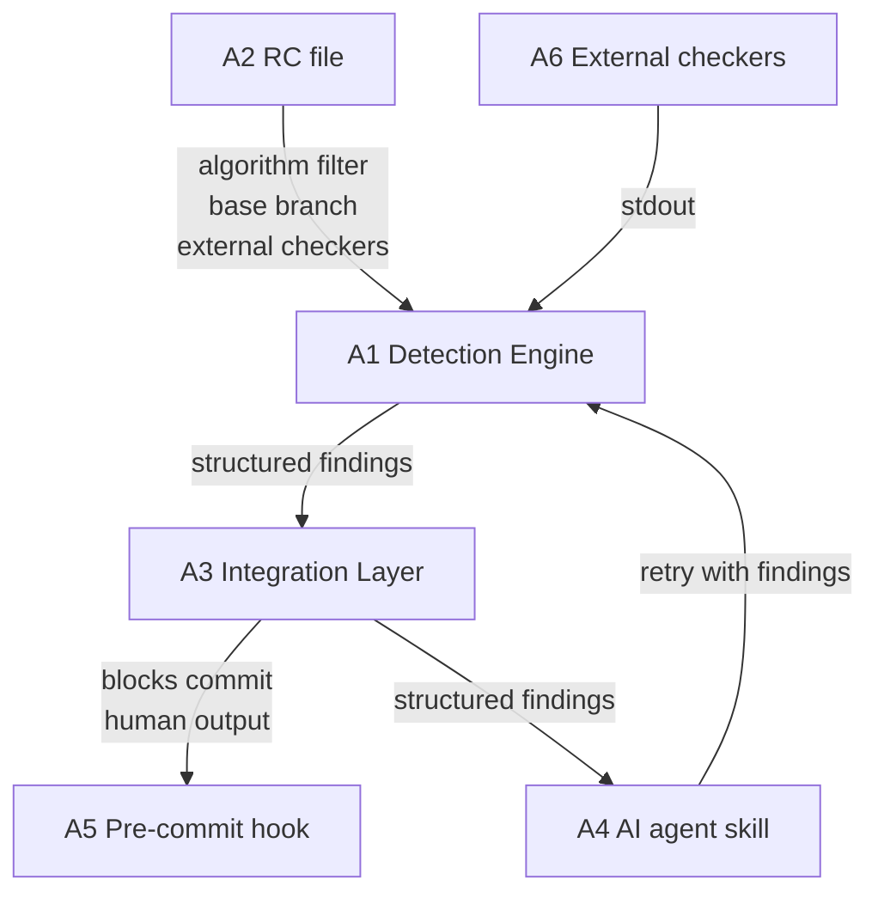

# Three-Component System Requirements

## Summary

Smart Code Reviewer is built from three components: a pluggable Detection Engine that runs deterministic checks and produces structured findings, a Rules & Configuration control plane (per-repo RC file) that governs which algorithms run and how, and an Integration Layer that exposes detection as a pre-commit hook and an AI agent skill.

---

## Problem Frame

Engineers using AI coding agents ship code that passes tests but drifts from product spec, duplicates existing functionality, or violates structural principles. The reviewer sits inside the generation loop — between code being written and code being committed — so that AI agents receive structured error messages and can self-correct before the commit lands.

The three-component split reflects a real separation of concerns: what checks to run (Detection Engine), how to configure them per project (Rules & Configuration), and how to surface results to humans and agents (Integration Layer).

---

## Key Decisions

- **CLI-first architecture.** The Detection Engine is a standalone CLI binary. The Integration Layer invokes it via subprocess and parses structured output. An MCP adapter is deferred until the output schema is stable — building the MCP surface on a shifting schema would require frequent breaking changes.

- **Diff mode always has full codebase access.** Diff mode narrows *what is checked* (changed files only) but the engine always searches the full codebase for cross-file references. Duplication detection requires finding where duplicate code already exists; restricting the search to the diff would miss cross-file duplication.

- **XOR enable/disable.** The RC file may specify an enable list OR a disable list, never both simultaneously. The engine treats a config with both lists as an error. This simplifies RC file semantics: one clear intent per configuration.

- **External checker normalization is the engine's responsibility.** The engine runs the external checker command, ingests stdout, and maps the output to the standard result schema. Callers receive one uniform schema regardless of checker origin.

- **All algorithms enabled by default.** When the RC file contains no enable/disable configuration, all registered algorithms run. Opt-out is the default posture; teams disable noisy algorithms rather than explicitly opting in to each one.

---

## Actors

- A1. **Detection Engine** — runs registered algorithms and external checkers; produces a structured findings list.
- A2. **Rules & Configuration** — per-repo RC file consumed by the Detection Engine at runtime; governs base branch, algorithm filter, and external checker definitions.
- A3. **Integration Layer** — invokes the Detection Engine CLI; renders findings for pre-commit and AI agent consumers.
- A4. **AI coding agent** (Claude Code, Codex, Copilot, etc.) — receives structured findings via the agent skill; retries code generation with the findings as context.
- A5. **Human engineer** — invokes the pre-commit hook or runs the CLI directly; reads human-rendered output.
- A6. **External checker** — a third-party tool (linter, style checker, etc.) invoked by the Detection Engine via shell command; stdout is ingested and normalized.

---

## Requirements

**Detection Engine**

- R1. The Detection Engine exposes a plugin registry. New algorithms can be registered without modifying core engine code.
- R2. The engine supports two scan modes: full (all files in the codebase) and diff (changed files relative to the configured base branch).
- R3. In diff mode, the engine searches the full codebase for cross-file references when producing findings (e.g., the existing location of a duplicated block). Only *what is checked* is narrowed; the reference search space is always the full codebase.
- R4. The engine supports external checker integration. The RC file may define one or more external checkers as a name and shell command. The engine runs each command, ingests stdout, and normalizes the output to the standard result schema.
- R5. The engine validates at startup that the RC file does not contain both an enable list and a disable list. If both are present, the engine exits with a config error before running any checks.

**Result Schema**

- R6. Every finding, regardless of algorithm or external checker origin, includes: file path (repo-relative), line number, failure description, reference to the related code section (repo-relative file path and line number), detection timestamp (ISO 8601), algorithm name, and algorithm methodology.
- R7. The result schema is stable across algorithm versions. Breaking changes to the schema are versioned.

**Rules & Configuration**

- R8. The RC file is per-repository. It lives at the repo root and is not inherited from a global user-level config.
- R9. The RC file accepts: base branch name (default: `main`), an algorithm enable list OR disable list (XOR, not both), and external checker definitions (name + shell command pairs).
- R10. When the RC file contains no enable/disable entry, all registered algorithms run.

**Integration Layer**

- R11. The pre-commit hook invokes the Detection Engine CLI in diff mode. If any findings are returned, the hook blocks the commit and prints human-readable output.
- R12. The AI agent skill invokes the Detection Engine CLI and returns the structured findings list to the calling agent.
- R13. Human-readable output and AI-structured output are separate renderings of the same result schema produced by the Detection Engine.

---

## Key Flows

- F1. **Pre-commit check**
  - **Trigger:** Engineer runs `git commit`.
  - **Actors:** A1, A2, A3, A5.
  - **Steps:** Hook invokes CLI in diff mode → engine reads RC file → runs enabled algorithms + external checkers against changed files (with full codebase reference access) → returns findings → Integration Layer renders human output → hook blocks commit if findings exist.
  - **Outcome:** Commit is blocked with a human-readable findings report, or proceeds if no findings.

- F2. **AI agent self-correction**
  - **Trigger:** AI agent finishes generating code and calls the agent skill.
  - **Actors:** A1, A2, A3, A4.
  - **Steps:** Skill invokes CLI in diff mode → engine runs checks → returns structured findings → skill surfaces findings to agent → agent retries generation with findings as context → skill re-invokes → loop continues until no findings or agent escalates.
  - **Outcome:** AI agent self-corrects before committing, or escalates to human review if findings persist.

---

## Acceptance Examples

- AE1. **XOR enable/disable enforcement**
  - **Covers:** R5.
  - **Given:** RC file contains both `enable: [semgrep]` and `disable: [cosine]`.
  - **When:** The engine starts.
  - **Then:** Engine exits with a config error naming the conflict; no checks run.

- AE2. **External checker ingestion**
  - **Covers:** R4, R6.
  - **Given:** RC file defines an external checker with command `eslint --format json .`
  - **When:** A check runs.
  - **Then:** Engine runs the command, maps eslint output to the standard result schema (file, line, description, timestamp, algorithm name = `eslint`, methodology = `external-lint`), and includes findings in the unified result alongside built-in algorithm findings.

- AE3. **Diff mode cross-file reference**
  - **Covers:** R3.
  - **Given:** A changed file contains a function that duplicates one in an unchanged file.
  - **When:** The engine runs in diff mode.
  - **Then:** The finding includes a reference to the unchanged file's location as the duplicate source, even though that file was not in the diff.

- AE4. **Default all-enabled state**
  - **Covers:** R10.
  - **Given:** RC file exists but contains no enable or disable entry.
  - **When:** A check runs.
  - **Then:** All registered algorithms execute.

---

## Scope Boundaries

**Deferred for later**
- MCP adapter for the Integration Layer — deferred until the result schema (R6–R7) is stable across at least one algorithm release cycle.
- CI/CD integration beyond the pre-commit hook — not addressed here.
- Global (user-level) RC file — only per-repo RC is in scope.

**Outside this product's identity**
- Automatic fix suggestions — the product detects and reports; remediation is the AI agent's job.
- Algorithm severity ratings (error vs warning tiers) — not in scope for this version.

---

## Dependencies / Assumptions

- The result schema normalization for external checkers (R4) assumes external checkers write findings to stdout in a parseable format. Checkers that write to stderr only or produce binary output are out of scope for this version.
- Full codebase access (R3) assumes the engine runs in an environment where the full repo checkout is available. Remote or shallow-clone environments are not addressed here.
