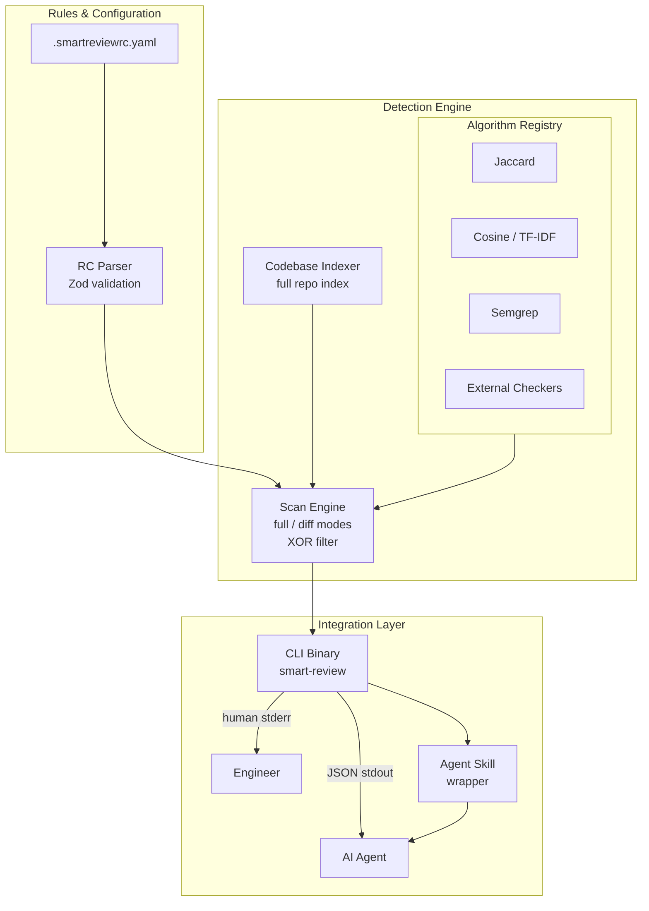
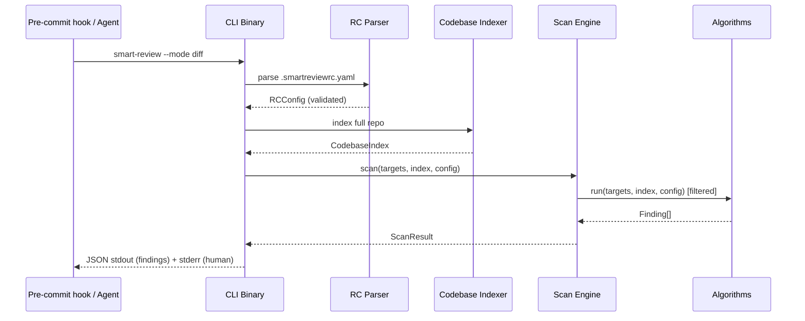

# feat: Build three-component code review system

## Summary

Build Smart Code Reviewer as a TypeScript npm package with three components: a pluggable Detection Engine (algorithms + external checker intake), a per-repo Rules & Configuration control plane (YAML RC file), and an Integration Layer (hook-agnostic CLI binary + AI agent skill interface). The CLI publishes as `smart-review` and outputs structured JSON findings to stdout; consumers (pre-commit hooks, AI agents, humans) invoke it and handle the result in their own context.

---

## Problem Frame

AI coding agents ship code that passes tests but silently drifts from spec, duplicates existing functionality, or violates structural principles. The reviewer embeds inside the generation loop as a pre-commit hook and an AI agent skill — so findings reach the agent at the moment of generation, not after a human review cycle. All check logic must be deterministic and reproducible so agents can self-correct reliably.

---

## Requirements

**Detection Engine**

- R1. The engine exposes a plugin registry. New algorithms implement a common `Algorithm` interface and register at startup without modifying engine core.
- R2. The engine supports two scan modes: `full` (all files) and `diff` (changed files relative to the configured base branch).
- R3. In `diff` mode, the engine searches the full codebase when resolving cross-file references (e.g., finding the existing location of a duplicated block). Only the set of files *checked* is narrowed; the reference search space is the full codebase.
- R4. The engine supports external checker integration. The RC file registers external checkers as name + shell command pairs. The engine runs each command, ingests stdout, and normalizes output to the standard `Finding` schema.
- R5. The engine validates at startup that the RC file does not contain both an enable list and a disable list. If both are present, the engine exits with a config error before running any checks.

**Result Schema**

- R6. Every finding — from any built-in algorithm or external checker — includes: repo-relative file path, line number, failure description, cross-reference (repo-relative file path + line of the related code), detection timestamp (ISO 8601), algorithm name, and algorithm methodology.
- R7. The result schema is stable. Breaking schema changes are versioned.

**Rules & Configuration**

- R8. The RC file (`.smartreviewrc.yaml`) is per-repository. There is no global user-level config.
- R9. The RC file accepts: `base_branch` (default `main`), an `enable` list OR a `disable` list (XOR, not both), and `external_checkers` (array of name + command).
- R10. When the RC file contains no `enable` or `disable` entry, all registered algorithms run.

**Integration Layer**

- R11. The CLI binary (`smart-review`) invokes the Detection Engine and exits 0 when no findings exist, 1 when findings exist, and 2 on error. This allows pre-commit hooks and CI gates to use the exit code directly.
- R12. The CLI outputs findings as a JSON array to stdout and human-readable output to stderr. Machine consumers read stdout; humans read stderr.
- R13. The AI agent skill interface wraps the CLI and returns structured findings to the calling agent with enough context for the agent to self-correct.

---

## Key Technical Decisions

- **TypeScript + Node.js.** User-confirmed. TypeScript provides type safety for the `Finding` schema — the cross-component contract — and Node.js has native `child_process` for semgrep and external checker invocation.

- **`Algorithm` interface as the plugin contract.** Each algorithm implements `{ name: string; methodology: string; run(targets: string[], index: CodebaseIndex, config: RCConfig): Promise<Finding[]> }`. The registry holds a map of name → instance. This is idiomatic TypeScript and avoids the overhead of a file-system plugin discovery mechanism for v1.

- **YAML RC file via `js-yaml`.** `.smartreviewrc.yaml` is the per-repo config file. YAML is the standard format for developer tooling RC files. `js-yaml` parses it with full type safety when combined with a Zod schema for validation.

- **Zod for RC validation.** The RC schema is validated with Zod at startup so config errors surface before any algorithm runs. The XOR enable/disable constraint is a Zod `.refine()` rule (covers R5).

- **Semgrep via subprocess.** Semgrep is invoked as `semgrep --json` via `child_process.execFile`. The engine parses the JSON output and normalizes each match to a `Finding`. Semgrep must be installed separately; the engine checks for its presence at startup and skips the algorithm with a warning if absent.

- **Jaccard similarity on AST tokens.** Duplication detection uses Jaccard similarity on sets of code tokens (split by whitespace and punctuation). No heavy ML dependency; fast enough for diff-mode use. Threshold is configurable in the RC file.

- **Cosine similarity via TF-IDF.** A second duplication detector using TF-IDF vectors over token sequences, implemented with the `natural` npm library. Catches semantic duplication that Jaccard misses (same logic, different variable names). Also threshold-configurable.

- **Semantic similarity deferred.** Sentence-transformer-based semantic similarity requires a model download and adds significant startup latency. Deferred to follow-up; the plugin registry accommodates it without engine changes.

- **Hook-agnostic CLI binary.** The package publishes `smart-review` as a bin entry. Users wire it into whatever hook system they already use (`husky`, Python `pre-commit` framework with `language: node`, raw `.git/hooks/`). The tool does not install hooks itself.

- **JSON stdout + human stderr.** Findings array to stdout so machine consumers can pipe and parse. Human-readable table to stderr so both streams are useful in terminal sessions.

- **`commander` for CLI parsing.** Standard TypeScript CLI library with no framework opinions. Provides `--mode`, `--base-branch`, `--config`, and `--format` flags.

---

## High-Level Technical Design



**Scan engine data flow:**



---

## Output Structure

```
smart-code-reviewer/
├── src/
│   ├── types/
│   │   └── index.ts              # U1: Finding, Algorithm, RCConfig, ScanResult
│   ├── registry/
│   │   └── index.ts              # U2: AlgorithmRegistry
│   ├── config/
│   │   └── rc-parser.ts          # U3: RC parser + Zod schema + XOR validation
│   ├── indexer/
│   │   └── codebase-indexer.ts   # U4: full-repo file index
│   ├── algorithms/
│   │   ├── jaccard.ts            # U5: Jaccard similarity
│   │   ├── cosine.ts             # U6: TF-IDF cosine similarity
│   │   ├── semgrep.ts            # U7: Semgrep subprocess adapter
│   │   └── external-checker.ts   # U8: generic external command adapter
│   ├── engine/
│   │   └── scan-engine.ts        # U9: scan orchestrator
│   └── integration/
│       ├── cli.ts                # U10: commander CLI entry point
│       └── agent-skill.ts        # U11: AI agent skill wrapper
├── tests/
│   ├── config/
│   ├── algorithms/
│   ├── engine/
│   └── integration/
├── package.json
├── tsconfig.json
└── .smartreviewrc.yaml           # example RC file committed to repo
```

---

## Implementation Units

### U1. Type system and result schema

**Goal:** Define the TypeScript interfaces that form the cross-component contract.

**Requirements:** R6, R7.

**Dependencies:** None.

**Files:**
- `src/types/index.ts`
- `tests/types/index.test.ts`

**Approach:** Define `Finding`, `Algorithm`, `CodebaseIndex`, `RCConfig`, `ScanResult`, and `ScanMode` as exported TypeScript interfaces and types. `Finding` carries all seven required fields. `Algorithm` carries the plugin interface contract. No runtime logic in this unit — types only.

**Test scenarios:**
- Test expectation: none — pure type definitions; shape is verified by the TypeScript compiler and consumed by downstream unit tests.

**Verification:** `tsc --noEmit` passes with all downstream units importing from `src/types/index.ts`.

---

### U2. Algorithm registry

**Goal:** Implement the plugin registry that algorithms register into and the scan engine queries from.

**Requirements:** R1, R4, R5 (partial — XOR validation is RC parser's job; registry applies the filter).

**Dependencies:** U1.

**Files:**
- `src/registry/index.ts`
- `tests/registry/index.test.ts`

**Approach:** `AlgorithmRegistry` holds a `Map<string, Algorithm>`. Exposes `register(algo: Algorithm)`, `list(): Algorithm[]`, and `filter(enable?: string[], disable?: string[]): Algorithm[]`. `filter` returns the subset matching the XOR config; it does not validate that both lists are absent — that is the RC parser's concern.

**Test scenarios:**
- Register one algorithm → `list()` returns it.
- Register two algorithms, `filter({ enable: ['jaccard'] })` → returns only Jaccard.
- Register two algorithms, `filter({ disable: ['semgrep'] })` → returns all except semgrep.
- `filter()` with no args → returns all registered algorithms.

**Verification:** All filter scenarios pass; registry is importable from downstream units.

---

### U3. RC file parser and validator

**Goal:** Parse `.smartreviewrc.yaml` and validate the config, including the XOR enable/disable constraint.

**Requirements:** R5, R8, R9, R10.

**Dependencies:** U1.

**Files:**
- `src/config/rc-parser.ts`
- `tests/config/rc-parser.test.ts`

**Approach:** Use `js-yaml` to parse the file and Zod to validate the schema. The Zod schema uses `.refine()` to reject configs that set both `enable` and `disable`. When neither is set, the parsed config carries `enable: undefined, disable: undefined` which the registry treats as all-enabled. `base_branch` defaults to `main` when absent. `external_checkers` is an optional array of `{ name: string; command: string }`.

**Patterns to follow:** Zod `.refine()` with a descriptive error message for the XOR constraint.

**Test scenarios:**
- Valid YAML with `enable` list → parsed `RCConfig` with correct enable array. (Covers AE1 partial.)
- Valid YAML with `disable` list → parsed `RCConfig` with correct disable array.
- YAML with both `enable` and `disable` → Zod error naming the conflict. (Covers AE1.)
- YAML with neither → `enable: undefined, disable: undefined` (all-enabled state). (Covers AE4.)
- `base_branch` absent → defaults to `'main'`.
- `base_branch: develop` → `'develop'` in parsed config.
- External checker defined with name + command → parsed correctly.
- Invalid YAML (syntax error) → parse error surfaced before validation.
- RC file absent → returns default config (all-enabled, base branch `main`).

**Verification:** All Zod validation paths exercised; XOR constraint error message names both fields.

---

### U4. Codebase indexer

**Goal:** Build an in-memory index of all files in the repository, used by all algorithms for cross-file reference lookups.

**Requirements:** R3.

**Dependencies:** U1.

**Files:**
- `src/indexer/codebase-indexer.ts`
- `tests/indexer/codebase-indexer.test.ts`

**Approach:** Walk the repo root recursively using Node.js `fs/promises` with a configurable ignore list (`.git/`, `node_modules/`, binary extensions). Returns `CodebaseIndex`: a `Map<string, string>` of repo-relative path → file content. Called once per scan invocation and passed to all algorithms so each algorithm does not independently re-read the filesystem.

**Test scenarios:**
- Index a temp directory with 3 files → all three appear in the map with correct content.
- `.git/` and `node_modules/` directories are excluded.
- Binary files (`.png`, `.woff`) are excluded.
- Empty directory → empty index, no error.

**Verification:** Index is populated and passed through to algorithm units; no algorithm re-reads files independently.

---

### U5. Jaccard similarity algorithm

**Goal:** Detect duplicate code blocks by comparing token sets between the target file and all files in the codebase index.

**Requirements:** R1, R6 (algorithm name: `jaccard`, methodology: `token-set similarity`).

**Dependencies:** U1, U2, U4.

**Files:**
- `src/algorithms/jaccard.ts`
- `tests/algorithms/jaccard.test.ts`

**Approach:** For each function or block in the target files (split by blank lines as a simple heuristic), tokenize (split on whitespace and punctuation), compute Jaccard coefficient against every block in the codebase index. Emit a `Finding` when the coefficient exceeds the configured threshold (default 0.8). The `Finding.reference` field carries the repo-relative path and approximate line of the most similar existing block. Registers itself into `AlgorithmRegistry` on import.

**Test scenarios:**
- Identical code block in two files → finding emitted with reference pointing to existing file. (Covers AE3.)
- Slightly modified block (variable renamed) → finding emitted when coefficient ≥ threshold.
- Completely different blocks → no finding.
- Threshold set to 1.0 in RC → only exact matches produce findings.
- `Finding` includes correct algorithm name (`jaccard`) and methodology.

**Verification:** Findings include cross-file reference; threshold is respected; algorithm name and methodology fields are populated.

---

### U6. Cosine similarity algorithm (TF-IDF)

**Goal:** Detect semantic duplication — same logic with different variable names — using TF-IDF cosine similarity.

**Requirements:** R1, R6 (algorithm name: `cosine-tfidf`, methodology: `TF-IDF cosine similarity`).

**Dependencies:** U1, U2, U4.

**Files:**
- `src/algorithms/cosine.ts`
- `tests/algorithms/cosine.test.ts`

**Approach:** Use the `natural` npm library (`TfIdf` class) to build TF-IDF vectors for each code block in the codebase index. For each block in the target files, compute cosine similarity against all indexed blocks. Emit a `Finding` when similarity exceeds the configured threshold (default 0.75). Registers itself into `AlgorithmRegistry` on import.

**Patterns to follow:** `natural.TfIdf` — addDocument / tfidfSync pattern.

**Test scenarios:**
- Two functions with same logic, different variable names → finding emitted.
- Structurally similar but semantically different code → no finding at default threshold.
- `Finding` includes algorithm name `cosine-tfidf` and methodology.
- Empty target file → no findings, no error.

**Verification:** Catches renamed-variable duplication that Jaccard misses; threshold configurable.

---

### U7. Semgrep algorithm

**Goal:** Run semgrep rules against target files and normalize findings to the standard result schema.

**Requirements:** R1, R6 (algorithm name: `semgrep`, methodology: `rule-based static analysis`).

**Dependencies:** U1, U2.

**Files:**
- `src/algorithms/semgrep.ts`
- `tests/algorithms/semgrep.test.ts`

**Approach:** Check for `semgrep` binary with `which semgrep` at registration time. If absent, register a stub that returns an empty findings array with a warning on stderr. When present, invoke `semgrep --json --config auto <files>` via `child_process.execFile`. Parse the JSON output — each `results[].extra.message`, `results[].path`, `results[].start.line` maps to a `Finding`. The `reference` field is populated from `results[].extra.lines` or left as the same file/line when no cross-reference is present.

**Test scenarios:**
- Semgrep installed, rule matches → `Finding` emitted with correct file, line, description, algorithm name.
- Semgrep not installed → empty findings array returned, warning logged to stderr (no thrown error).
- Semgrep exits non-zero (rule error) → error surfaced in findings with description from stderr.
- Multiple matches in one file → multiple findings emitted.

**Verification:** Semgrep output correctly normalizes to `Finding[]`; absent semgrep is a graceful degradation, not a crash.

---

### U8. External checker integration

**Goal:** Run arbitrary external commands defined in the RC file, parse their stdout, and normalize to the `Finding` schema.

**Requirements:** R4, R6 (algorithm name and methodology from RC config).

**Dependencies:** U1, U2, U3.

**Files:**
- `src/algorithms/external-checker.ts`
- `tests/algorithms/external-checker.test.ts`

**Approach:** For each entry in `rc.external_checkers`, create an `ExternalCheckerAlgorithm` instance at startup. The instance runs the configured command via `child_process.execFile`, reads stdout line by line, and applies a normalization heuristic: each line matching `<file>:<line>: <message>` (eslint/tsc format) maps to a `Finding`. Lines not matching this pattern are collected as a single `Finding` with line 0 and the raw output as description. The algorithm name is the checker's RC-configured name; methodology is `external-lint`.

**Test scenarios:**
- ESLint-format stdout line → normalized `Finding` with correct file, line, description. (Covers AE2.)
- Command exits non-zero → findings include an error finding describing the exit code.
- Command not found → error finding with description naming the missing command.
- Stdout with mixed matching and non-matching lines → both normalized and raw findings emitted.
- Algorithm name in finding matches RC-configured checker name.

**Verification:** All AE2 scenarios pass; algorithm name in finding matches RC config.

---

### U9. Scan engine

**Goal:** Orchestrate the full and diff scan modes, apply the algorithm filter from RC config, run all algorithms, and produce a `ScanResult`.

**Requirements:** R2, R3, R5, R10, R11 (exit code behavior is CLI's concern, but engine produces the data).

**Dependencies:** U1, U2, U3, U4, U5, U6, U7, U8.

**Files:**
- `src/engine/scan-engine.ts`
- `tests/engine/scan-engine.test.ts`

**Approach:** `ScanEngine.scan(mode, config, index)` — resolves target files based on mode (`full` = all indexed files; `diff` = files changed relative to `config.base_branch` via `git diff --name-only`). Applies `AlgorithmRegistry.filter(config.enable, config.disable)` to get the active algorithm set. Runs all active algorithms in parallel (`Promise.all`). Collects all `Finding[]` into a single `ScanResult`. The codebase index is always the full repo (R3); only `targets` is narrowed in diff mode.

**Patterns to follow:** `git diff --name-only HEAD <base_branch>` for changed file detection.

**Test scenarios:**
- Full mode → all indexed files passed as targets to each algorithm.
- Diff mode with 2 changed files → only those 2 files passed as targets; full index still available for cross-file lookup. (Covers AE3.)
- Enable filter in config → only enabled algorithms run.
- Disable filter in config → all registered except disabled run.
- No enable/disable → all registered algorithms run. (Covers AE4.)
- All algorithms return empty → `ScanResult.findings` is `[]`.
- One algorithm throws → error captured as a `Finding` with description of the failure, other algorithms continue.

**Verification:** Diff mode passes only changed files to algorithms but full index for reference lookups; XOR filter applied correctly.

---

### U10. CLI binary

**Goal:** Ship `smart-review` as the runnable entry point — accept flags, invoke the scan engine, and output results.

**Requirements:** R11, R12, R13 (partial).

**Dependencies:** U1, U3, U4, U9.

**Files:**
- `src/integration/cli.ts`
- `tests/integration/cli.test.ts`
- `package.json` (`bin` field pointing to compiled `dist/integration/cli.js`)

**Approach:** Use `commander` to define flags: `--mode <full|diff>` (default `diff`), `--base-branch <branch>` (overrides RC), `--config <path>` (default `.smartreviewrc.yaml`), `--format <json|human>` (default `json`). On invocation: parse RC, build codebase index, run scan engine, write findings JSON array to stdout, write human-readable table to stderr, exit with code 0 (no findings) or 1 (findings present) or 2 (error).

**Test scenarios:**
- `smart-review --mode diff` with mock findings → JSON array on stdout, exit 1.
- `smart-review --mode full` → all files scanned.
- `smart-review --base-branch develop` → overrides RC base_branch.
- No findings → empty JSON array `[]` on stdout, exit 0.
- Config error (bad RC) → error message on stderr, exit 2.
- `--format human` → human table on stdout (not stderr) for direct terminal use.
- JSON output per finding has all 7 required fields.

**Verification:** Exit codes are correct; stdout is valid JSON; human stderr renders correctly in terminal.

---

### U11. AI agent skill interface

**Goal:** Provide a thin wrapper over the CLI that AI agents (Claude Code, Codex, Copilot) can call and receive structured findings from.

**Requirements:** R12, R13.

**Dependencies:** U10.

**Files:**
- `src/integration/agent-skill.ts`
- `tests/integration/agent-skill.test.ts`
- `SKILL.md` (Claude Code skill definition for Smart Code Reviewer)

**Approach:** `AgentSkill.check(options)` invokes the CLI binary via `child_process.execFile`, captures stdout (JSON findings), parses it, and returns `{ passed: boolean; findings: Finding[] }`. The agent skill returns a structured result rather than raw CLI output so the calling agent doesn't need to parse JSON itself. `SKILL.md` provides a Claude Code skill definition so the tool can be invoked as `/smart-review` inside a Claude Code session.

**Test scenarios:**
- CLI returns findings → `AgentSkill.check()` returns `{ passed: false, findings: [...] }`.
- CLI returns empty array → `{ passed: true, findings: [] }`.
- CLI exits 2 (error) → `AgentSkill.check()` throws with error description.
- `SKILL.md` exists and contains correct invocation pattern.

**Verification:** Agent receives structured result without parsing JSON; SKILL.md is present and references the correct CLI command.

---

## Scope Boundaries

**Deferred for later** *(from brainstorm)*
- MCP adapter — deferred until the result schema is stable across at least one release cycle.
- CI/CD integration beyond pre-commit hook.
- Global (user-level) RC file.

**Outside this product's identity** *(from brainstorm)*
- Automatic fix suggestions — detection and reporting only; remediation is the agent's job.
- Algorithm severity ratings (error vs. warning tiers).

**Deferred to follow-up work**
- Semantic similarity algorithm (sentence-transformer-based) — requires model download and adds startup latency. Plugin registry accommodates it without engine changes.
- `--format sarif` output — SARIF is the standard format for GitHub Code Scanning; deferred until CI/CD integration is in scope.
- Jaccard/cosine threshold configurability per-algorithm — RC file currently supports global thresholds; per-algorithm overrides are deferred.

---

## Risks & Dependencies

- **Semgrep availability.** Semgrep must be installed separately. The engine degrades gracefully (U7), but users who expect semgrep checks without installing it will get silent no-ops. Mitigation: log a startup warning naming the missing binary.
- **Git availability.** Diff mode (`git diff --name-only`) requires git in `PATH`. Mitigation: detect at startup and fall back to full mode with a warning.
- **`natural` library TF-IDF accuracy.** TF-IDF cosine similarity may produce false positives on short code blocks. Mitigation: default threshold set conservatively (0.75); configurable in RC file.
- **Large repository performance.** The codebase indexer reads all files into memory. A monorepo with thousands of files may cause memory pressure. Mitigation: add `.smartreviewignore` support (deferred) and document that `node_modules/` and binary files are excluded by default.

---

## Sources & Research

- Semgrep JSON output schema: `semgrep --json` emits `{ results: [{ path, start: { line }, extra: { message, lines } }] }` — used in U7 normalization.
- `natural` npm library TfIdf API: `new TfIdf(); tfidf.addDocument(tokens); tfidf.tfidfSync(term, index)` — used in U6.
- `commander` npm library: standard TypeScript CLI framework — used in U10.
- `js-yaml` npm library: `yaml.load(fileContent)` returns parsed object — used in U3.
- Zod `.refine()` pattern for cross-field validation — used in U3 for XOR constraint.
- Pre-commit framework `language: node` docs: packages must expose a `bin` entry in `package.json` — used in U10 packaging.
